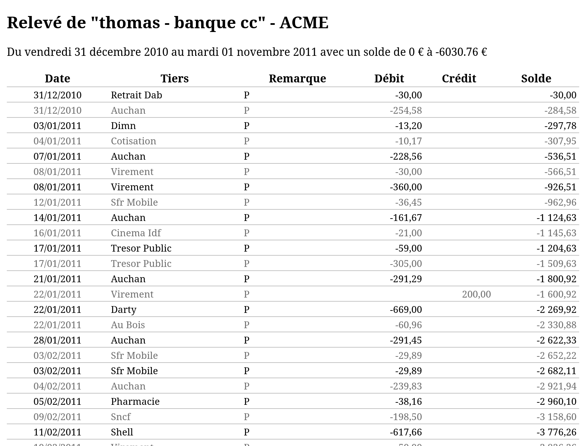

# Kif

**Kif** est une application qui a pour but de générer un affichage agréable et imprimable de relevés bancaires au format QIF.

L'origine de ce projet est de donner la possibilité de présenter de manière lisible et agréable les relevés de comptes d'une petite association.

Le logiciel de comptabilité utilisé pour générer les données à tester s'appelle [Grisbi](https://github.com/grisbi/grisbi).
